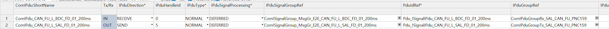

### Harmonize
collapsed:: true
	- BswM / AL_DirvierInitTwo / 10,20,30
	- ECU/Mcal/Can/Hardware Object 에서 Hw Object Count를 1로
- ### Communication Control
  collapsed:: true
	- NM은 동작하지만, Normal Mesage는 동작안됨
	- 미확인
		- ComM 에 ComMUserPerChannel_CAN_FU 추가 (설정-integrator role)
		- System / Bswmd / Bswmd_Dcm : EXPLICIT_ORDER , OnTransitionValue = 255
	- ECU > Ecud_Com.arxml > Com > All Contents
		- ComIPdu_CAN_FU_L_BDC_FD_01_200ms : IPduGroupRef 에  Rx 추가
		- ComIPdu_CAN_FU_L_SAL_FD_01_200ms : IPduGroupRef 에  Tx 추가
		- 
		- Com_GaaTxIpduStatus [5]  가  1이면 -> TxEnable , 0 이면 TxDisable
		- 변경 후 Com_GaaTxIpduGroup 의 사이즈가 4에서 5로 변경되었다
		- Com_GaaIpduGroup[5].ddNoOfTxIpdus 값이 0에서 1로 변경되어서 Status 변경이 가능해 졌다
		-
-
	-