### LIN
collapsed:: true
	- Lin_43_LPUART_FLEXIO_SendFrame
		- Lin_43_LPUART_FLEXIO_SendFrame
			- Lin_43_LPUART_FLEXIO_Ipw_SendFrame
				- Lpuart_Lin_Ip_SendFrame
					- Lpuart_Lin_Ip_StartSendFrame
						- Lpuart_Lin_Ip_HwSetBreakCharDetectLength
						- Lpuart_Lin_Ip_HwSetIntMode
						- Lpuart_Lin_Ip_HwQueueBreakField
							- Base->DATA = LPUART_DATA_FRETSC(1U);
	- Lin_43_LPUART_FLEXIO_GetStatus
	- Lpuart_Lin_Ip_IRQHandler
	  id:: 650ce860-7e2a-40e9-8285-e6aa97f55838
- ### CAN
  collapsed:: true
	- Can_43_FLEXCAN_Write
		- Can_43_FLEXCAN_Ipw_Write
			- FlexCAN_Ip_Send
				- FlexCAN_StartSendData
					- FlexCAN_SetTxMsgBuff
- ### SleepMode
  collapsed:: true
	- 최종 : CanTrcv_SleepMode
	- Task : CanSm_MainFunction
		- 평상시 : CanSM_FullCommunication
		- Sleep 진입 요청 시 : CanSM_SilentCommunication  -> 여기에서 호출
			- CanSM_DeInitPnNotSupported > CanSM_SetCanTrcvMode > CanIf_SetTrcvMode > CanTrcv_SetOpMode
			- UDS 진행 중에는 여기에 도달하지 않더라
- ### ECU Reset
	- EcuM_SelectShutdownTarget > Rule_ShutdownTargetTo_RESET > BswM_Immediate_DcmEcuReset < SchM_Switch_Dcm_DcmEcuReset < Dcm_DcmECUResetService < Dcm_DsdIndication < Dcm_DslCheckPrtclStatus < Dcm_MainFunction
	- Power_Ip_MC_ME_SocTriggerResetEvent < Mcu_Ipw_PerformReset < Mcu_PerformReset < EcuM_AL_Reset < EcuM_Shutdown < ShutdownHook < Os_ShutdownCore < Os_KernShutdownOS
- ### Det_GaaErrors
	- usModuleId = 35 -> CANTP_MODULE_ID
	- usInstanceId = 0 -> CANTP_INSTANCE_ID
	- ucApiId = 66 -> CANTP_RXINDICATION_SID
	- ucErrorId = 176 -> CANTP_E_COM
- ###  NVM
	- 최초 NVM Write
	  collapsed:: true
		- 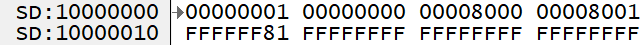
			- Fee_JobInternalScanClusterFmt < Mem_FeeInitPerform
				- Fee_SerializeClusterHdr
				  Fee_SerializeFlag
				  Fee_WriteToFls  (Nvm , MemIf 없이 바로 호출)
				  4Byte  = 0x0000001 (ClrHdr->ClrID)
				  4Byte = 0x00000000 (ClrHdr->StartAddr)
				  4Byte = 0x00008000 (ClrHdr->Length)
				  4Byte = 0x00008001 (checksum
				  1Byte = 0x81 (FEE_VALIDATED_VALUE)
				  Fee_ClrGrps / FeeCluster_0 (addr = 0x00000000 , size = 0x8000) / FeeCluster_1 (addr = 0x00001000 , size = 0x4000)
		- 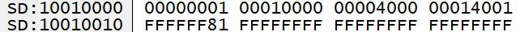
			- address = 0x10000000
	- DTC 발생
	  collapsed:: true
		- NvM_WriteBlock 을 막았더니 DTC는 NVM에 안써지더라
	- Ecu reset
	  collapsed:: true
		- block @1
			- 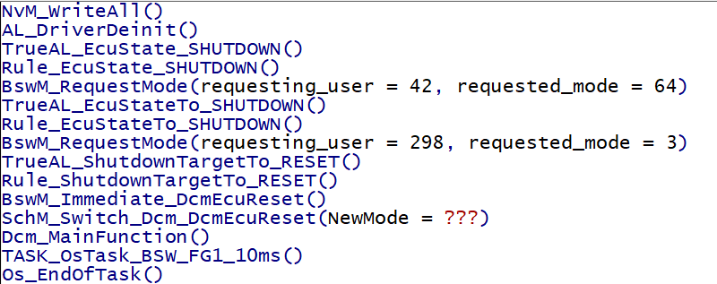
			- NvM_WriteBlock 막고 테스트 진행
			- NvM_ProcessWriteAllBlocks  -> NvM_MainFunction >  if(NvM_GucWriteAllRequest == NVM_MULTIBLK_REQUESTED)
			- MemIf_Write : DeviceIndex= 0, BockNumber = 22, DataBufferPtr =
			- Fee_Write : BlockNumber = 22 (NmLog) -> BlockIndex = 16 (Fee_GetBlockIndex 사용해서 변환) -> Fee_uJobBlockIndex = 16
			- Fee_JobWriteHdr : BlockNumber = 22 , Length = 202
				- DataAddr = 0x8000(DataAddrIt ) - 208(AlignedBlockSize) = 0x7F30
				- HdrAddr = 0x30 -> Fee_serializeBlockHdr
			- Fee_WriteToFls
				- Fls_Wite : TagetAddress = 0x30 , length = 16
			- Fee_JobWriteBlockData
				- Fls_Write : TargetAddress = 0x7f30, length = 192
		- Fls_Wite : TagetAddress = 0x7FF0 , length = 16
		- Fls_Wite : TagetAddress = 0x40 , length = 16
		- 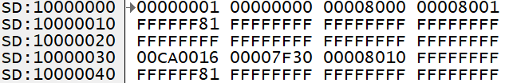
		- Fee_JobWriteHdr > Fee_SerializeBlockHdr
			- 0x0016 : block number
			- 0x00CA (202) : length
			- 0x00007F30 : address
			- 0x00008001 : checksum
		- Fee_JobWriteBlockValidate
			- 0x81 : FEE_VALIDATED_VALUE
	- NVM 변동 확인
		- collapsed:: true
		  1. 최초
			- 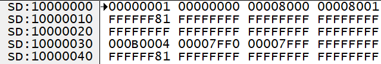
			- 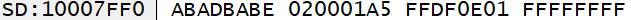
			-
		- collapsed:: true
		  2. DTC 발생
			- 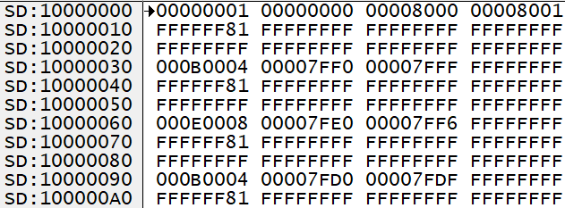
			- 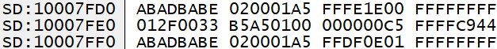
			-
		- collapsed:: true
		  3. 시스템 리셋 (DTC 상황 해제 후 리셋)
			- 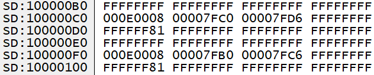
			- 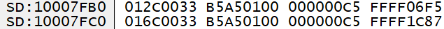
			- DTC가 없는 상황에서는 리셋을 반복해도 NvmWrite가 없는데
			  DTC가 있는 상황에서는 리셋을 하면 계속 위의 내용이 추가된다
		- collapsed:: true
		  4. 다시 리셋
			- 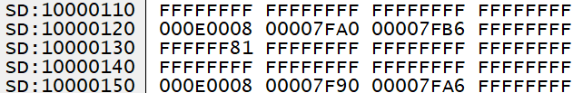
			- 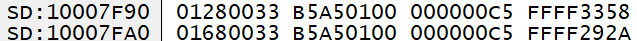