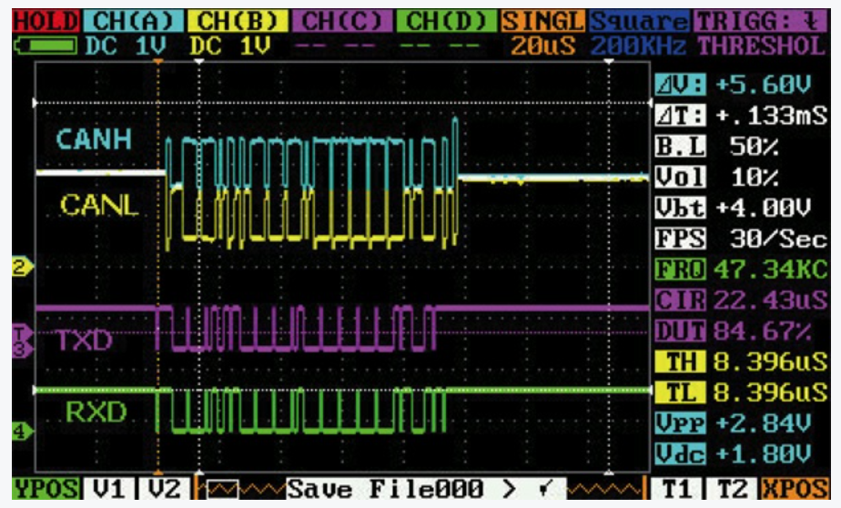
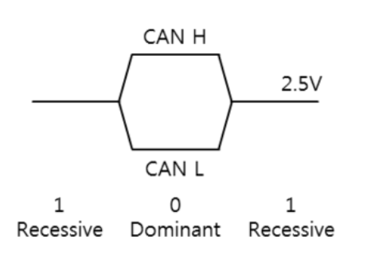
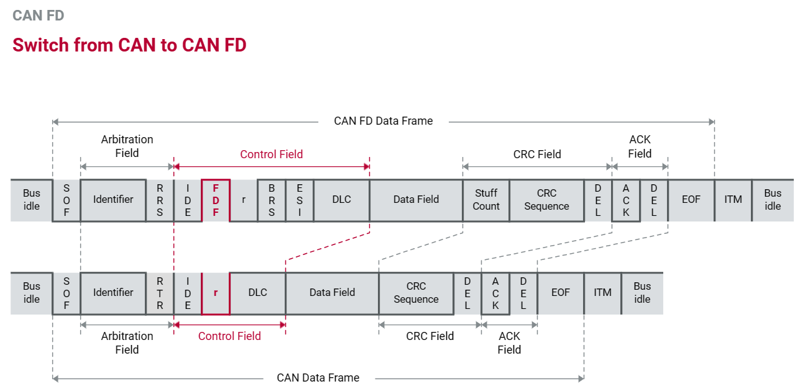

- CAN
  collapsed:: true
  title:: 공부/CAN
	- Frame의 종류
		- Standard
			- ID 11bit
			- data : 8byte
		- Extended
			- ID 29bit
			- data : 8byte
		- Remote
			- data field 없음
			- 메시지의 재전송이 필요한 경우 전송되는 프레임
			- 모든 data를 정확하게 수신받아야 할 때 사용
			- 자동차에서는 사용X
		- Error Frame
	- Message Format
		- 
		- IDE  0:standard , 1:extended
- CAN FD
  collapsed:: true
	- 길이 : 8byte -> 64byte
	- 속도 :  1Mbps -> 5Mbps (100kbps ~ 5Mbps)
- CAN Network
  collapsed:: true
	- Sleep
	- Wakeup
		- Normal
		- LimpHome
- 종류
  collapsed:: true
	- C-CAN (샤시)
		- C-CAN은 차량의  클러스터(CLU), YRS(Yaw Rate Sensor)엔진, 미션, ABS(Anti-lock Breaking System), ECU(Engine Control Unit), TCU(Transmission Control Unit)와 같은 고속으로 데이터를 전송하는 용도로 사용되며 통신 속도는 500kbps입니다.
		- 주로 사용하는 캔트랜시버로는 Microchip의 MCP2561, MCP2562를 사용합니다.
	- B-CAN (바디)
		- B-CAN은 C-CAN에 비해 저속으로 통신합니다. 스마트키모듈, BCM(Body Control Module) 라이트, 파워윈도우와 같은 자동차의 운전과 관계없는 통신에 주로 사용되며 통신 속도는 100kbps입니다.
		- 주로 사용하는 캔트랜시버로는 NXP의 TJA1054, TJA1055를 사용합니다.
	- M-CAN
		- 전자 기기들로서 내비게이션, 차량 내 멀티미디어 통신 기기와의 연동을 위한 각종 모듈을 포함
	- P-CAN
		- DATC모듈, TCU, EMS(ECU,각종 센서, 각종 액츄에이터) 등이 있으며, 샤시 관련해서 겹치는 통신이 있음
- 게이트웨이
- KWP2000 / UDS
  collapsed:: true
	- KWP2000 on K-Line
		- 단일 와이어 형태의 물리적 통신방식
		- 단일 메시지 당 255바이트 데이터 전송
		- 데이터 전송 가능한 크기도 작으며 1대1 단방향 통신의 단점으로 최근에는 사용하지 않음
	- KWP on CAN
		- 데이터 전송 속도는 MAX가 1Mbps, 진단통신은 500Kbps
		- 8바이트 싱글프레임 단위로 데이터 통신을 하며, 8바이트가 넘어가면 멀티프레임 통신을 함
		- 11비트 길이의 ID가 사용되며 CAN 제어기 마다 ID가 있다. 낮은 수의 CAN ID가 먼저 통신 할 수 있는 우선권이 있음
		- 버스 이용률 손실이 없음
	- UDS on CAN
		- KWP on CAN을 ISO 14229로 확장한 프로토콜
		- Sub Function 도입으로 진단 서비스 요청이 기존보다 상세화 됨
- 계층
  collapsed:: true
	- 네트워크레이어 용어
		- 그림
		  collapsed:: true
			- 
		- toB
			- 송신 측에서 First Frame을 송신하고 Flow Control Frame을 수신하기 전까지의 시간
		- toC
			- 수신 측에서 Flow Control Frame을 송신하고 Consecutive Frame을 수신하기 전 까지의 시간
		- Stmin
			- 2개의 Consecutive Frame 사이의 지연시간
		- BSMax
			- 수신 측에서 Flow Control Frame을 받은 후, 다음 Flow Control Frame을 받기 전까지 순시할 수 있는 연속 Frame의 개수
- 인터넷 자료
  collapsed:: true
	- [자동차 통신 CAN (Controller Area Network) 통신 소개 및 동작 방법 :: 자율주행 자동차 (tistory.com)](https://weeklylife.tistory.com/26)
	- [AUTOSAR CAN Frame, PDU, Signal 통신 : 네이버 블로그 (naver.com)](https://m.blog.naver.com/techref/222435471400)
	- [CAN (Controller Area Network) : 네이버 블로그 (naver.com)](https://m.blog.naver.com/PostView.naver?isHttpsRedirect=true&blogId=hanbulkr&logNo=221329481315)
- PIN 설정
- baudrate
  collapsed:: true
	- CAN_BitRate = CAN_CLK / (CAN_Prescaler * (CAN_SJW + CAN_BS1 + CAN_BS2))
- 종단저항
  collapsed:: true
	- [CAN 통신에서 종단저항의 중요성 (amsla.xyz)](https://amsla.xyz/230)
	- [9. 자동차 CAN 통신 시스템에서 종단저항(termination resistor)을 두는 이유를 설명하시오. : 네이버 블로그 (naver.com)](https://m.blog.naver.com/profeels/221568128580)
- NM
  collapsed:: true
	- Direct OSEK NM
		- 네트워크를 형성하고 있는 한 노드가 다른 노드들에 의해 모니터링 되는 방식
		- NM전용 메시지 및 Token 방식을 이용해 하나의 노리 링을 구성함
	- Indirect OSEK NM
		- 네트워크 관리 메시지를 따로 정의해 사용하는 것이 아니라 주기적으로 전송되는 어플리케이션 메시지를 이용
		- 논리 링을 구성하지 않음
		- 주기적으로 전송되는 애플리케이션 메시지가 각 노드당 최소한 한 개이상 정의되 있어야 함
	- AUTOSAR CAN NM
		- [OSEK - NM (tistory.com)](https://mechanical-software.tistory.com/29)
		- 주기적으로 전송되는 NM 전용 메시지를 사용하는 것에 기반함
		- Network Mode
			- Repeat Message State
			- Normal Operation State
			- Ready Sleep State
		- Prepare Bus-Sleep Mode
		- Bus-Sleep Mode
	- Master-Slave NM
- BASIC / FULL
  collapsed:: true
	- [Basic CAN, Full CAN이란? 메시.. : 네이버블로그 (naver.com)](https://blog.naver.com/techref/222003464882)
	- BASIC
		- 메시지큐
		- FIFO
		- Filtering 을 SW적으로 수행
	- FULL
		- 메시지버퍼
		- 원하는 크기와 개수를 지정
		- 해당메시지의 전용 버퍼에만 메시지를 채운다
- CAN TX/RX PIN
  collapsed:: true
	- [stm32 - Can Tx-Rx Data Line - Electrical Engineering Stack Exchange](https://electronics.stackexchange.com/questions/624715/can-tx-rx-data-line)
	- [CAN Protocol | mbedded.ninja](https://blog.mbedded.ninja/electronics/communication-protocols/can-protocol/)
- TX RX HIGH LOW
  collapsed:: true
	- TX : Tx , Rx Pin에 같은 파형
	- RX : Tx 는 High, Rx Pin에 data파형
- CAN 통신 셋업
  collapsed:: true
	- [한국마이크로칩테크놀로지 (microchipkorea.com)](http://www.microchipkorea.com/html/support/tech_inquiry_view.asp?no=13146)
	- [What is CAN Send Acknowledge? - RACELOGIC Support Centre](https://en.racelogic.support/VBOX_Motorsport/Product_Info/Video_Data_Loggers/Video_VBOX_Range/Knowledge_Base/What_is_CAN_Send_Acknowledge%3F)
	- [CNA기본 pdf](https://www.google.co.kr/url?sa=i&url=https%3A%2F%2Fdept.kookje.ac.kr%2Fautomobile%2Findex.php%3FpCode%3Dnotice2%26pg%3D2%26mode%3Dfdn%26idx%3D397%26num%3D2&psig=AOvVaw2FFd5xwx-TNqk7oacLjoTL&ust=1695548182863000&source=images&cd=vfe&opi=89978449&ved=0CBIQjhxqFwoTCPDv76q3wIEDFQAAAAAdAAAAABAJ)
	- 파형
		- 
		- 리세시브 (1)
			- CAN H와 CAN L의 전위차가 없을 때는 recessive (열성)
			- CAN TX = HIGH
			- CAN HIGH = 2.5V , CAN LOW = 2.5V
		- 도미넌트 (0)
			- CAN H와 CAN L의 전위차가 있을 때는 dominant (우성)
			- CAN TX = LOW
			- CAN HIGH = 3.5V , CAN LOW = 1.5V
		- RX pin 파형
			- CAN High, CAN Low에서 되돌아 오는 신호는 AND 연산되어 RXD(CAN RX)로 출력됩니다. 즉, 자신이 CAN 버스를 사용하여 무언가를 전송중일 때는 CAN TX와 CAN RX의 신호를 오실로스코프로 관찰해보면 동일한 파형이 관찰됩니다
		- 도미넌트 우선
			- 두개 이상의 노드가 리세시브와 도미넌트를 동시에 출력했을 경우, 버스 상태는 도미넌트가 되고, 버스에 있는 모든 노드는 CAN 버스가 도미넌트라고 인식하게 된다
	- ACK
		- CANH와 CANL 신호는 예상대로 차동이며, 더 높은 차동 전압을 가진 ACK(acknowledge) 비트를 CAN 프레임의 끝에서 명확하게 볼 수 있다. 이 높은 전압은 ACK 비트를 병렬로 동시에 발생시키는 복수 CAN 노드들의 결과값이다. ACK 비트를 쉽게 파악할 수 있는 또 다른 방법은, 그것을 TXD 신호가 아닌 RXD 신호에서 볼 수 있다는 것이다. 즉, 다른 노드들이 원래대로 이것을 발생시켰다는 뜻이다.
	- 에러
		- 에러 종류
			- BIT 에러 : 송신 bit와 수신 bit가 상이한 경우
			- ACK 에러 : 수신 장치가 응답이 없을 때, 통신 선로가 끊기거나 접촉 불량인 경우
			- FORMAT 에러 : CRC del, ACK del, EOF 영역에 0 (dominant) 값이 나타난 경우
			- STUFF 에러 : Stuffing 규칙이 맞지 않은 경우
			- CRC 에러 : CRC가 맞지 않은 경우
		- CAN 제어기 내부에는 송신 에러 카운터와 수신 에러 카운터가 각각 있습니다. 에러가 검출될 때마다 카운터가 1씩 증가하고, 에러 없이 성공적으로 전달이 완료되면 카운터가 1씩 감소합니다. 초기 상태에는 Error active 상태이며, 에러 카운터 값이 127 보다 커지면 Error passive 상태가 됩니다. 그리고 에러 카운터 값이 255를 초과하면 BUS OFF 상태로 해당 노드를 CAN 망에서 끊어버립니다
		- [CAN Bus, Protocol (5): Er.. : 네이버블로그 (naver.com)](https://blog.naver.com/wlsellfe_joon/222937145351)
		- [[통신] CAN 통신 - CAN 통신 메시지 .. : 네이버블로그 (naver.com)](https://blog.naver.com/dlrudans4610/222976685914)
		- [[CAN 통신] CAN 통신 에러 : 네이버 블로그 (naver.com)](https://blog.naver.com/ekqlsl96/222998531893)
		- 
- 소스 분석
  collapsed:: true
	- Baudrate
		- Can_aBaudrateConfig_Ctrl0
		- Flexcan_aCtrlConfigPB
	- RX
	  collapsed:: true
		- Can_43_FLEXCAN_MainFunction_Read
			- Can_43_FLEXCAN_Ipw_MainFunction_Read
				- FlexCAN_Ip_Receive
				- FlexCAN_Ip_MainFunctionRead
					- FlexCAN_IRQHandlerRxMB
						- FlexCAN_GetMsgBuff
							- FlexCAN_ComputePayloadSize
							- FlexCAN_GetMbPayloadSize
								- FlexCAN_GetPayloadSize
									- 여기에서 payload가 8로 고정되버리네
				- FlexCAN_Ip_GetTransferStatus
				- Can_Ipw_ParseData
					- CanIf_RxIndication
		- ID Message Type을 Extended로 설정하면 수신이 안되네
		- FULL / BASIC 바꿔도 변화가 없는데..
	- TX
	  collapsed:: true
		- Can_43_FLEXCAN_Write
			- Can_ValidateHth
			- Can_ValidatePdu
			- Can_43_FLEXCAN_Ipw_Write
				- FlexCAN_Ip_Send
					- FlexCAN_StartSendData
						- FlexCAN_SetTxMsgBuff
		- Can_43_FLEXCAN_MainFunction_Write
			- Can_43_FLEXCAN_Ipw_MainFunction_Write
				- FlexCAN_Ip_MainFunctionWrite
					- Can_43_FLEXCAN_CommonIrqCallback
				- CanIf_TxConfirmation
	- RX ISR
		- CAN0_ORED_0_31_MB_IRQHandler
			- FlexCAN_IRQHandler
				- FlexCAN_IRQHandlerRxMB
					- Can_43_FLEXCAN_CommonIrq
						- Can_43_FLEXCAN_ProcessMesgBufferCommonInterrupt
							- Can_43_FLEXCAN_Ipw_ProcessHwObject
								- Can_43_FLEXCAN_Ipw_ProcessRxMesgBuffer
									- Can_Ipw_ParseData
										- CanIf_RxIndication
- CAN FD
  collapsed:: true
	- 
	- BRS : Control field 와 Data field 비트 속도 up
	- FDF : 1이면 CAN FD frame
	- control bit : 6 -> 9
	- data bit : 8 -> 64
	- ID의 길이
		- 11bit : standard
		- 29bit : extended
	- [CAN FD Protocol Tutorial | Kvaser](https://www.kvaser.com/can-fd-protocol-tutorial/)
- Physical / Functional
  collapsed:: true
	- DIAG Functional Can Rx ID : 0x7DF (GST_ALL)
	- DIAG physical Can Rx ID : 0x705
	- DIAG physical Can Tx ID : 0x70D
	- Physical : 여러개의 ECU들 중에서 하나만 보낼 때
	- Functional : 모든 제어기들에 한번에 보낼 때
	-
- ### Partial Network
  collapsed:: true
	- [CAN 노드의 부분 비활성화 (autoelectronics.co.kr)](https://www.autoelectronics.co.kr/article/articleView.asp?idx=959)
		- 특정 웨이크업 메시지를 감지할 수 있어야 한다
		- 오실레이터의 정밀도가 중요하다
	- [How Selective Wake Enables Partial Networking (Rev. B)](https://www.ti.com/lit/an/slla521b/slla521b.pdf?ts=1699426613143&ref_url=https%253A%252F%252Fwww.google.com%252F)
- WUF vs WUP
  collapsed:: true
	- [icc_2017_slides_hell.pdf (can-cia.org)](https://www.can-cia.org/fileadmin/resources/documents/slides/icc_2017_slides_hell.pdf)
	- https://support.vector.com/kb?id=kb_article_view&sysparm_article=KB0012123
	- WUP
		- 5usec 이상이면 OK
		- 200kbps
			- 1bit = 5usec -> 모든 메시지 = WUP
		- 500kbps
			- 2usec * 3 = 6usec -> 3개 연속된 '1' 필요
			- CBFF : RTR+IDE+FDF
			- CEFF : RFR +FDF+r0
			- FBFF
			- FEFF
- 리세시브 vs 도미넌트
	- [CAN 통신의 개요 (Controller Area Network)](https://m.blog.naver.com/lagrange0115/221941482740)
	- CANTX = 1 : 리세시스 2.5V 
	  CANTX = 0 : 도미넌트 1.5V ~ 3.5V
	- 회로적으로 도미넌트의 우선순위가 높다
	  arbitration phase에서 낮은 ID를 가진 node가 우선순위를 가지고 출력되고
	  자신의 출력파형과 다른 node는 출력을 멈춰야 한다.
	- [CAN (Controller Area Network)](https://blog.naver.com/bycho211/221029297220)
-
	-