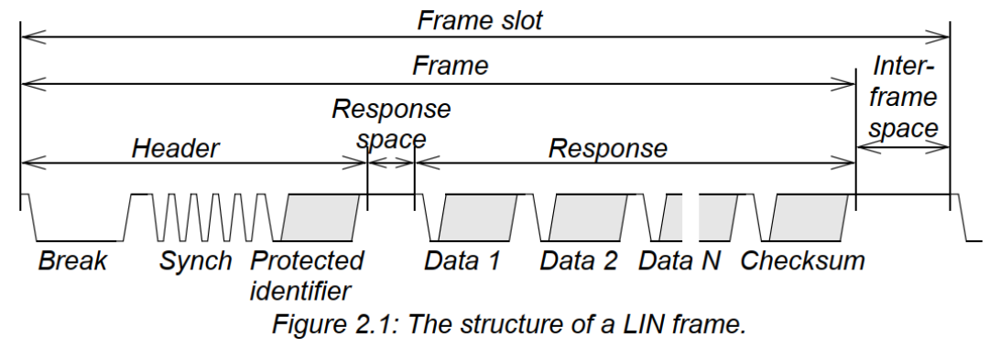
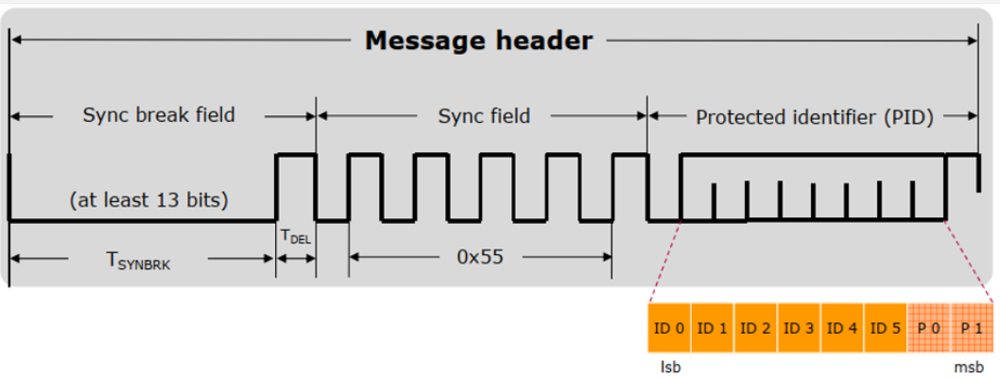
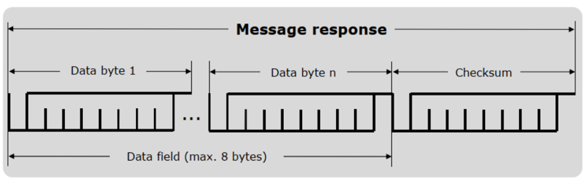

- 인터넷 자료
	- [LIN 통신의 개요 : 네이버 블로그 (naver.com)](https://blog.naver.com/PostView.naver?blogId=lagrange0115&logNo=222657181251)
	- [LIN통신 LIN 2.0을 공부하기 전에..(필독) (tistory.com)](https://87c196mc.tistory.com/10?category=1174111)
	- [LIN Bus : www.onesemi.co.kr (ivyro.net)](http://sweet2649.ivyro.net/iimmgg/lin/LIN_Spec.html)
	- [글쓰는 엔지니어 :: LIN 통신이란? FAQ (tistory.com)](https://kennyshin.tistory.com/12)
	- [LIN Bus Explained - A Simple Intro [2023] – CSS Electronics](https://www.csselectronics.com/pages/lin-bus-protocol-intro-basics)
	- [LIN 통신 프로토콜 - Physical Layer, LIN Frame (tistory.com)](https://cookbook.tistory.com/61)
	- [LIN통신 LIN2.0 Protocol Spec.(2) ~ 2.3 Frame Types (tistory.com)](https://87c196mc.tistory.com/6)
- 예제 코드
  collapsed:: true
	- [LPC54608 LIN master basic usage sharing - NXP Community](https://community.nxp.com/t5/LPC-Microcontrollers-Knowledge/LPC54608-LIN-master-basic-usage-sharing/ta-p/1118103)
- 코드
	- Baudrate
		- Lpuart_Lin_Ip_HwInit
		- CH0 : 9600 -> 19200
		- Ch1 : 9600 -> 2400
		- clock이 Lin Configuration 설정에 따르지 않고 Clock tap의 설정에 따른다
		- Uart clock ref 설정이 되지 않는다
	- RX data
		- LIN_43_LPUART_FLEXIO_IPW_DRIVER_HAS_SLAVE_NODE 값이 OFF여서 callback에서 XX
	- LPUART0_LIN_IP_RxTx_IRQHandler
		- Lpuart_Lin_Ip_IRQHandler
			- Lpuart_Lin_Ip_FrameIrqHandler
				- Lpuart_Lin_Ip_ProcessReceiveFrameData
					- Lin_43_LPUART_FLEXIO_Ipw_Callback
	- RX
		- 마스터모드에서 PID 0x0A (0xCA)를 tx하면 RxComplete발생한다
		- RxBuffer에 값도 들어간다
		- LIN_43_LPUART_FLEXIO_IPW_DRIVER_HAS_SLAVE_NODE  어찌 처리할꼬?
	-
- LIN 프로토콜
  collapsed:: true
	- 기본 프로토콜
	  collapsed:: true
		- 
		- Header
			- 
			- 패리티 비트
				- XOR 연산하여 2bit 값을 만든다
			-
		- Response
			- 
			- Cheksum
				- classic : 데이터 필드만 sum 한 값
				- Enhanced : 데이터 필드와 PID 를 sum 한
	- Reponse 데이터
		- Master가 채우는 경우
		- Slave가 채우는 경우
		- 없는 경우 : Slave 들의 상태를 물어볼 때
	- LIN Schedule 테이블
	  collapsed:: true
		- NCF
			- slave 노드마다 가진 테이블 이름
		- LDF
			- slave3개 파일을 모두 합친 것
			- Master에서 사
	- PID
		- response data length
			- 0x00 ~ 0x1F : 2
			- 0x20 ~ 0x2F : 4
			- 0x30 ~ 0x3F : 8
		- 프레임 종류
			- 무조건 프레임(Unconditional frame)
				- ID : 0x00 ~ 0x3B(59)
				- 스케줄대로 Master는 header를 보내고 slave는 frame을 채운다
			- 이벤트 트리거 프레임 (Event triggered frame)
				- ID : 0x00 ~ 0x3B(59)
			- 간헐적 프레임 (Sporadic frame)
				- ID : 0x00 ~ 0x3B(59)
			- 진단 프레임 (Diagnostic frame)
				- ID : 0x3C , 0x3D
			- 사용자 정의 프레임 (User-defied frame)
				- ID : 0x3E
			- 예약 프레임 (Reserved frame)
				- LIN 2.0에서는 사용되지 않는다
				- ID : 0x3F
			- 신호 기반 진단 (Signal based Diagnostic)
	- Publisher / Subscriber
		- publisher : 데이터 필드를 채워 넣는 것
		- subscriber : 채워진 데이터를 소비하는 것
		- 마스터는 header를 보내고 ID를 보고 해당 모듈은 자신의 ID이면 데이터를 채워 넣는