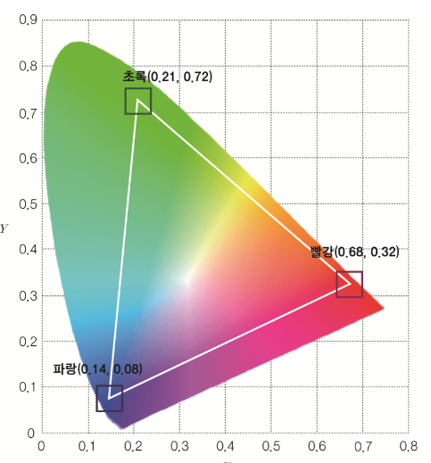

- 컬러 모드
  title:: 공부/컬러
	- RGB
	- HSV
		- 원뿔형태
		- H : 생상
		- S : 채도
		- V : 명도
	- YCrCb
		- 영상 시템에서 사용
		- Y : 휘도
		- Cr , Cb : 색차
		- Y가 커지면 전체적으로 밝아진다
	- CIE XYZ
		- 수학적으로 정의된 색공간
		- 인간의 색채 인지에 대한 실험 연구에서 분광 광도계로 측정한 값들을 기초로 하여 x, y, z 값들로 표현한 것으로, 밝기를 제외한 채도와 색상을 표현
		- CIE1931
		- CIE 1931 색좌표는 (x, y, z)로 표현되며, x, y, z는 각각 빨강, 초록, 파랑의 비율에 해당합니다. 따라서, x + y + z = 1, 즉, 100%가 되죠.
		- {:height 421, :width 388}
		-
	- CIE Lab
- 용어
	- 색상
	- 명도
		- 밝다 / 어둡다
	- 채도 (Saturation)
		- 색의 순수성
		- 짙다 / 흐리다